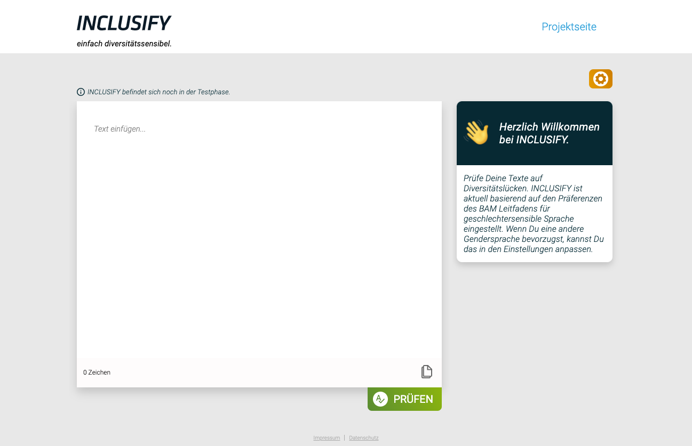
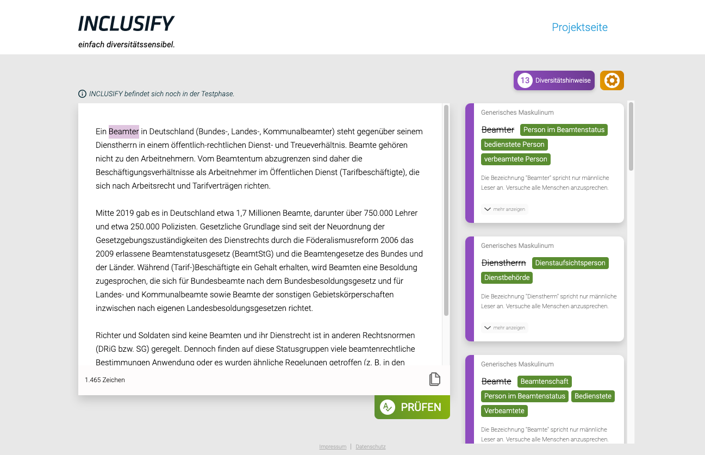

<h1></h1>

[ [Live Demo](https://inclusify.tech.4germany.org/) 🚀 | [Project Info](https://tech.4germany.org/project/diversitatssensible-sprache-inclusify-bam/) 💁 | [Tech4Germany Fellowship][t4g] 🤓 ]

<a href="./doc/images/screenshot-inclusify-welcome-page.png"></a>
<a href="./doc/images/screenshot-inclusify-with-results.png"></a>

🇬🇧 This is the source code repository of the _INCLUSIFY_ project of the [Tech4Germany Fellowship][t4g] 2021.
You can use this code under the terms of the provided license.

🇩🇪 Die ist das Source-Code Repository des Projekts _INCLUSIFY_ des [Tech4Germany Fellowships][t4g] 2021.
Sie können den Code unter den Bedingungen der angegeben Lizenz nutzen.

[t4g]: https://tech.4germany.org/

## About INCLUSIFY

Together with the [_Federal Institute for Materials Research and Testing_](https://www.bam.de/) (Bundesanstalt für Materialforschung und –prüfung (BAM)), we developed a software prototype to support the practical use of diversity-sensitive language in German.

Our goal is both to promote awareness for diversity and to make every-day use of diversity-sensitive language easier.

INCLUSIFY currently offers two modes of use:

1. A standalone webpage where users can paste their text, receive feedback and improvement suggestions, and apply these to their text in the browser.
2. An add-in for Microsoft Word, with which users can check their documents right in Word, receive feedback and improvement suggestions, and apply these to their document without leaving the app.

## Using the INCLUSIFY Docker image

Make sure to have [Docker](https://www.docker.com/) installed.

Use the following command to download the INCLUSIFY Docker image and start a new container. Note that the image is quite large and may take some time to download.

```sh
docker run --rm -p 80:80 -ti --pull always ghcr.io/tech4germany/inclusify-app:latest
```

Once you see a message like _"Done loading morphological dictionary."_, you can open http://localhost in your web browser and use the INCLUSIFY web-app from there! 🥳

_Note: This Docker image hosts the app without HTTPS. This is fine for local testing, but isn't appropriate for any kind of deployment where other people use the app. For actual production deployments, consider putting an HTTPS reverse proxy in front of the INCLUSIFY container._

## Technical Documentation

See [doc/index.md](./doc/index.md).

## License

This repository contains code and content we created ourselves, as well as content that we retrieved from other sources (some of it modified by us).

Our own source code and accompanying documentation in this repository are licensed under the [MIT license](./LICENSE). This applies to all files where no other license terms are included.

Files that are subject to other license terms are accompanied by appriopriate `LICENSE` files in the same or a higher directory.
