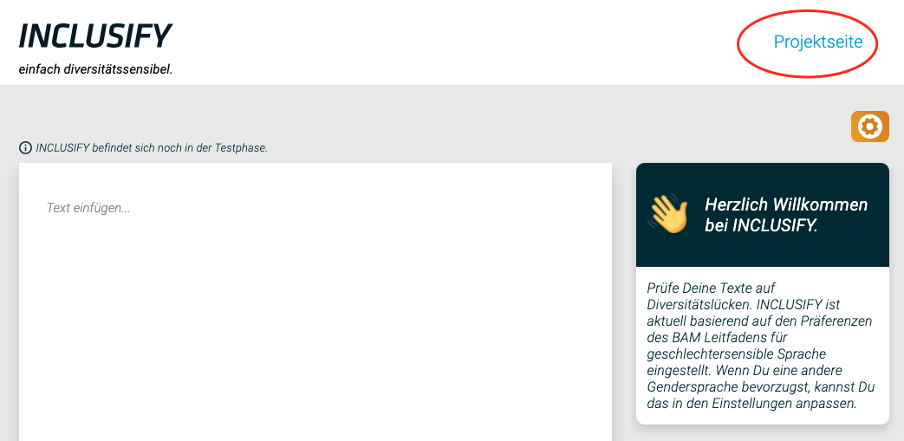
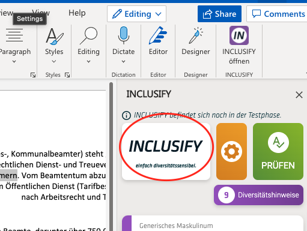

# INCLUSIFY App - React Frontend Documentation

The frontend (located in the `react-ui` directory) is written in TypeScript and uses the [React](https://reactjs.org/) framework. The frontend build is setup and managed using [Create React App](https://create-react-app.dev/) (CRA). No library for UI controls is in use, all UI controls have been built by hand according to the design spec for now.

As shortly described in the [System Overview](./system-overview.md), the INCLUSIFY app can be used either as a standalone webpage with an input text field, or as an add-in for Microsoft Word. In this documentation and in the source code, we generally call these two modes of use "**standalone**" and "**add-in**", respectively.

We enable these two modes of use with a single React frontend by using two entry points (unlike many common React apps, which only have one). These two entry points render the frontend in the appropriate way for the two different use cases, while sharing as much code as possible for common controls and common tasks.

The two app entry points are: `react-ui/src/standalone/standalone.tsx` for the standalone page and `react-ui/src/office-taskpane/taskpane.tsx` for the add-in.

## Environment variables used in the React frontend

We use environment variables to customize some parts of the frontend. All these environment variables start with `REACT_APP_` ([CRA requires this](https://create-react-app.dev/docs/adding-custom-environment-variables)).

- `REACT_APP_BUILD_FOR_BAM`: Set to "1" to build the BAM variant of the frontend, otherwise the general variant is built. The BAM variant differs mostly in some styling (e.g. a different logo) and is intended for internal use at [BAM](https://www.bam.de/).
- `REACT_APP_ENABLE_DEBUG_PANEL`: Set to "1" to enable the debug panel even in production builds (see below for more info).
- `REACT_APP_SHOW_IMPRESSUM_AND_DATENSCHUTZ`: Set to "1" to include links to an imprint and data privacy statement. This is intended for public internet deployments, such as our [public demo](https://inclusify.tech.4germany.org/).
- `REACT_APP_VCS_REVISION`: Set this to the Git commit ID from which the app is being built. It is included in a `<meta>` tag (with `name="built-from-git-sha"`) in the page HTML to make it easy to see which version is deployed.

## User Settings persistence

INCLUSIFY's user settings are persisted in the browser's LocalStorage, so they should generally be retained until the users clears their browser storage data.

The storage mechanism (implemented in `react-ui/src/common/user-settings/UserSettingsStorage.ts`) should automatically handle changes to the schema of the user settings object without causing errors on the user's side.

## Feature Flags and the Debug Panel

Feature flags (also called feature toggles) allow us to hide new features that aren't complete yet, or to make changes to certain behaviors during user tests. This makes it easy to try out different ideas and approaches in software (instead of just a click dummy) without having to switch between different versions of the frontend or different Git branches.

For production builds, the app simply uses the feature flag values defined in `react-ui/src/common/feature-flags/feature-flags.ts`.

For development builds (or if the environment variable `REACT_APP_ENABLE_DEBUG_PANEL` is set to "1" in production builds), feature flags can be changed at runtime and are persisted in the browser's LocalStorage. This persistence uses the same mechanism that is used for user settings (see above).

In this case, the feature flags are initialized with their default values defined in `react-ui/src/common/feature-flags/feature-flags.ts`, but can be changed in the Debug Panel. The Debug Panel can be shown and hidden using the keyboard shortcut <kbd>Ctrl</kbd>+<kbd>Shift</kbd>+<kbd>D</kbd> (or <kbd>Cmd</kbd>+<kbd>Shift</kbd>+<kbd>D</kbd> on Mac). It appears in the bottom left corner of the viewport.

## Adjusting the links in the navigation bar (Standalone) and for the INCLUSIFY logo (Add-in)

<a href="./images/standalone-navbar-links.png"></a>
<a href="./images/addin-logo-link.png"></a>

- You can adjust the external links shown in the INCLUSIFY app in the `navigation-links.json` file (i.e. the links shown in the navigation bar at the top of the Standalone page, and the link used for the INCLUSIFY logo element in the add-in)
  - Note: in both cases, URLs are only accepted when they start with "http://", "https://", or "mailto:".
- For the links shown in the navigation bar at the top of the Standalone page:
  - In `react-ui/src/navigation-links.json`, edit the list in the key `"standaloneNavigationLinks"`
  - Each item in this list must have at least the two entries `"title"` and `"url"` (both must be strings), and can optionally have an entry `"subtitle"` (also a string), which is shown under the "title" in smaller font
  - Example:
  ```json
  {
    // . . .
    "standaloneNavigationLinks": [
      {
        "title": "Contribute",
        "subtitle": "auf GitHub",
        "url": "https://github.com/tech4germany/bam-inclusify"
      },
      {
        "title": "Projektseite",
        "url": "https://github.com/tech4germany/bam-inclusify"
      }
    ]
    // . . .
  }
  ```
- For the link used for the INCLUSIFY logo element in the add-in:
  - In `react-ui/src/navigation-links.json`, edit the value of the key `"addinLogoLinkUrl"`
  - Example:
  ```json
  {
    // . . .
    "addinLogoLinkUrl": "https://github.com/tech4germany/bam-inclusify"
    // . . .
  }
  ```

## Office Add-in development

### Setting up certificates for local Office Add-in development

If you want to test the Office Add-in locally using the dev server (i.e. with `devcmd start-ui`), you must enable HTTPS for the dev server with the following steps.

_See also [`office-addin-dev-certs`](https://www.npmjs.com/package/office-addin-dev-certs) and the [Word add-in development docs](https://docs.microsoft.com/en-us/office/dev/add-ins/word/) for more info._

- (On macOS & Linux:) Go to `react-ui/node_modules/office-addin-dev-certs/cli.js` and change the end of lines format to `LF` to avoid a bug.
- Use `yarn office-addin-dev-certs install` to obtain certificates.
- Create a file `react-ui/.env.local` with the following contents (you can also replace `$HOME` with the path to your user home folder).

```
HTTPS=true
DEVSERVER_HTTPS_KEY=$HOME/.office-addin-dev-certs/localhost.key
DEVSERVER_HTTPS_CERT=$HOME/.office-addin-dev-certs/localhost.crt
DEVSERVER_HTTPS_CA=$HOME/.office-addin-dev-certs/ca.crt
```

### Polyfills for Internet Explorer webview in Windows Office apps

The Office add-ins are shown in IE11 webviews in certain constellations of Windows and Office versions (see [this overview](https://docs.microsoft.com/en-us/office/dev/add-ins/concepts/browsers-used-by-office-web-add-ins) for details). Since IE11 doesn't support many modern changes and extensions to the ECMAScript, we need to include polyfills to enable our application to run in this legacy environment.

Since we use [Create React App](https://create-react-app.dev/) to manage the setup and build of our React frontend, we automatically get good support to include the necessary polyfills during the build process. See [the CRA docs](https://create-react-app.dev/docs/supported-browsers-features/#supported-browsers) and [`react-app-polyfill`](https://github.com/facebook/create-react-app/blob/main/packages/react-app-polyfill/README.md) for more details.

To enable this support, we added "ie 11" to the `browserslist` key in `react-ui/package.json`, and additionally include the following two imports in our entry points `react-ui/src/standalone/standalone.tsx` and `react-ui/src/office-taskpane/taskpane.tsx`:

```ts
import "react-app-polyfill/ie11";
import "react-app-polyfill/stable";
```

**Caveat:** As of the end of the Tech4Germany project term, this method doesn't correctly polyfill [String.replaceAll()](https://developer.mozilla.org/en-US/docs/Web/JavaScript/Reference/Global_Objects/String/replaceAll), so we had to avoid it in one place. More details are documented in a code comment at the affected piece of code.
