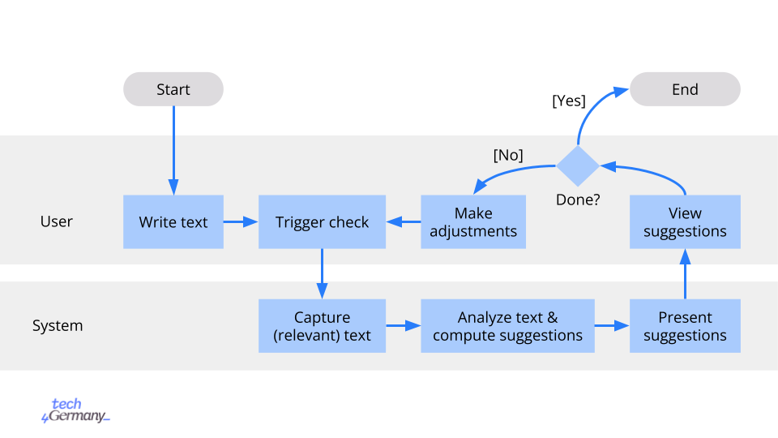

# INCLUSIFY App Technical Documentation

_Note: We have only used macOS and Linux for development, so these instructions might be incomplete for a Windows environment._

## Prerequisites for development

- [Node.js](https://nodejs.org/en/) v14 or newer
- [(Classic) Yarn](https://classic.yarnpkg.com/lang/en/) v1.22 or newer (though not Yarn 2)
- [Python 3](https://www.python.org/) v3.9 or newer
- (optional) if you want to build the Docker image or run the app in a Docker container: [Docker](https://www.docker.com/)

## First-time setup

After cloning this repo, do the following steps to get prepare your development environment:

- Install the dependencies for the dev scrips:  
  `cd dev_cmds && yarn install && yarn devcmd setup`
- If you want to use the [DevCmd](https://github.com/XITASO/devcmd) global launcher, also run:  
  `yarn global add devcmd-cli`

## DevCmd for dev scripts

We automated many common build and development tasks, mostly using [DevCmd](https://github.com/XITASO/devcmd). These scripts are located in the `dev_cmd` directory in the repo root.

We recommend installing and using DevCmd's global launcher tool (see above).

If you can't or don't want to use this global launcher, you can replace any command that looks like `devcmd <SCRIPTNAME>` equivalently with `cd dev_cmds && yarn devcmd <SCRIPTNAME>`.

## Parts of this repository

What is where (relative to the repo root):

- `data/` - word lists, text corpora, and other input data, as well as pre-processing scripts to turn this data into usable inputs for the NLP backend
- `dev_cmds/` - build scripts and development task automation using [DevCmd](https://github.com/XITASO/devcmd)
- `doc/` - this documentation
- `inclusify_server/` - the Python backend that analyzes users' inputs and provides improvement suggestions using NLP methods
- `react-ui/` - the graphical end-user app (frontend) for use as a standalone webpage in a browser and in Word/Outlook add-ins

## Starting the app for development

- First-time setup: `cd dev_cmds && yarn install && yarn devcmd setup`
- If you want to use the [DevCmd](https://github.com/XITASO/devcmd) global launcher (e.g. `yarn global add devcmd-cli`):
  - Start the API part: `devcmd start-api`
  - Start the UI part: `devcmd start-ui`
- Otherwise, you can use the scripts like this:
  - Start the API part: `cd dev_cmds && yarn devcmd start-api`
  - Start the UI part: `cd dev_cmds && yarn devcmd start-ui`

## React Frontend

See [frontend.md](./frontend.md).

## Application user flow

The high-level user workflow of the INCLUSIFY App works as follows:

- **User writes text.** This may happen in the text field of the Standalone web page, or the user may copy-paste their text into the text field, or they may compose their Word document and use the add-in.
- **User triggers check.** Currently, this happens either manually clicking a button or automatically when applying a replacement suggestion (see below). In the future, automatically (re)checking the text after the user changes it could be implemented.
- **System captures relevant text.** In the Standalone web page, this is just the whole plaintext content of the input text field. In the Word add-in, the system fetches the document content from the Word application and extracts the plain text from Word's internal representation.
- **System analyzes text and computes suggestions.** Using an NLP pipeline, the system finds parts of the user's text that could be made more inclusive and diversity-sensitive, and tries to suggest improvements.
- **System presents suggestions to user.** The flagged text parts and improvement suggestions are presented to the user, usually including an explanation.
- **User views suggestions.** If the user is done working on the text for the moment (e.g. when there are no more suggestions, or the user decides not to make any more changes), this ends the user flow.
- **User makes adjustments.** Alternatively, the user may make further adjustments to the text, e.g. applying a suggestion provided by the system (this automatically triggers a re-check of the modified text), making manual changes, or adding more text.
  - Note: Text replacement suggestions are currently implemented using a purely index-based approach in the plain-text representation of the user's text. Changes to the input text are not tracked, so replacements cannot be applied correctly when the input text changes. As a result, changing the input text disables any suggestions currently being presented.
